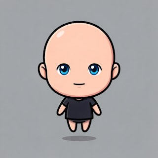
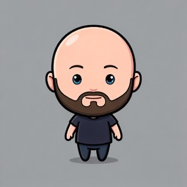
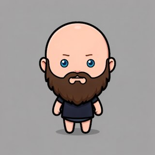
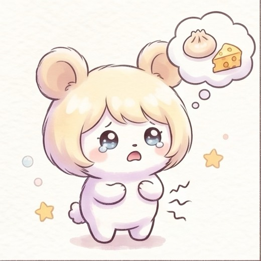
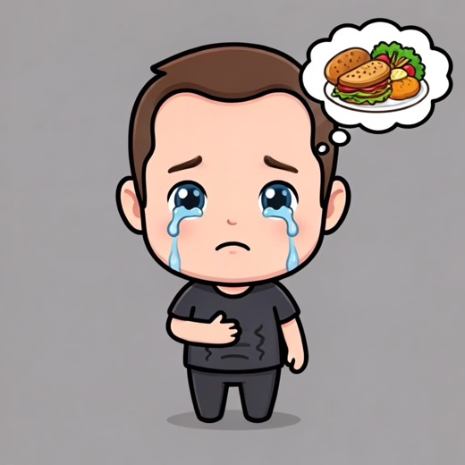
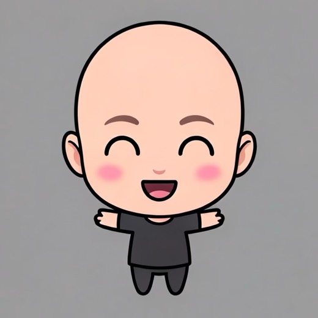
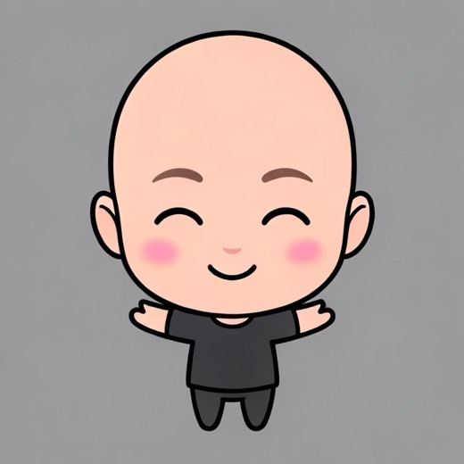
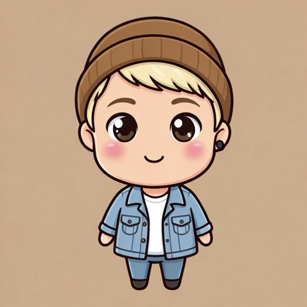
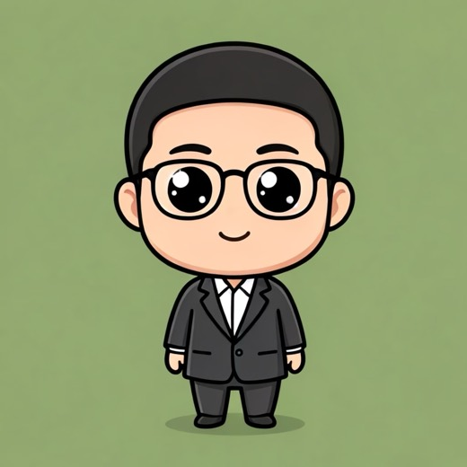
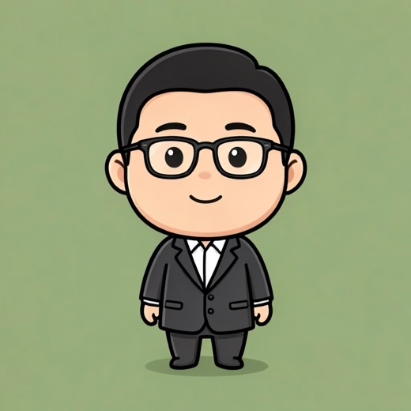

# I played on Apple’s Playground so You don’t have to

*I spent the whole of September inside Apple’s new Image Playground. Here is what came out.*

Kyle Choi · September 2026

Live page: **https://kylechoi101.github.io/xoxo-blog/** (hover any picture there for the iPhone model and the exact prompt; click to copy it).

> Every seed image on this page is AI-generated with Gemini. No photograph of a real person appears here or on the live page.

---

## Sep 1 · The first day

First, I generated avatars. An avatar is a mini version of you, so it has to carry all of your facial features. I drew seven facial types and checked whether Playground honored each one.

      

73 drawings in this round. The rest are in the dropdown on the live page.

## Sep 1 – 5 · Moods

Next, I wanted to see whether the avatars could be altered by mood keywords. At first I just said “make it look angry”, but Apple clearly had a different vision from mine. I also needed them to be kawaii. So I reversed the process: I had Gemini draw a reference image for each mood, had Claude describe that picture, and used the description as the keyword for the mood tile.

<table><tr><td align="center"> Angry, as Gemini imagined it</td><td align="center"> Playground’s take on the same brief</td></tr></table>

500 drawings in this round. The rest are in the dropdown on the live page.

## Sep 5 · First phone rounds

Then I checked whether the prompts survived on a real iPhone running an iOS close to release. As you can see, anything involving hands gave me problems. I also realized that Playground keeps the shape of the original picture, square or rectangular. My app goes square to rectangle.

<table><tr><td align="center"> The avatar, iOS 27 beta 8</td><td align="center"> Celebrating. Hands are the hard part</td></tr></table>

122 drawings in this round. The rest are in the dropdown on the live page.

## Sep 7 · A/B prompts

I tweaked the phrasing a bit more to see which wording survives a reliable regeneration cycle.

<table><tr><td align="center"> Prompt sent as text</td><td align="center"> Same prompt, hidden behind a title</td></tr></table>

30 drawings in this round. The rest are in the dropdown on the live page.

## Sep 8 – 12 · Realistic photos

I wanted to see whether the prompts held up on more realistic photos, not just portraits.

<table><tr><td align="center"> From a real-looking photo</td><td align="center"> The same person, love you</td></tr></table>

151 drawings in this round. The rest are in the dropdown on the live page.

## Sep 9 – 10 · Scoring against the reference

The results were getting better by then, so I built a scoring system to track the likeness and the kawaii-ness of each result.

<table><tr><td align="center"> Body clause last: a head</td><td align="center"> Body clause first: the whole body, 3 of 3</td></tr></table>

57 drawings in this round. The rest are in the dropdown on the live page.

## Sep 13 – 15 · Avatar labs

The real iOS 27 turned out a bit different from the betas. In the background it rewrites the prompt for its own on-device or Private Cloud Compute model. I had to find out which prompts survive the rewrite.

<table><tr><td align="center"> The shipped prompt</td><td align="center"> Same words, after “The same person as in the picture”</td></tr></table>

60 drawings in this round. The rest are in the dropdown on the live page.

## Sep 13 – 14 · All 54 through the app

Every mood redrawn from the avatar, on the phone, in one night.

<table><tr><td align="center"> Nostalgic, shipping prompt</td><td align="center"> Nostalgic, copying the reference</td></tr></table>

168 drawings in this round. The rest are in the dropdown on the live page.

## Sep 16 · Two phones, two iOS

iOS 26 has a Playground problem. If a user has not updated to iOS 27 yet, Playground draws glossy, unsettling 3D. iOS 27 draws flat kawaii characters. It was a hard bargain.

<table><tr><td align="center"> iPhone 17, iOS 26.6</td><td align="center"> iPhone 16, iOS 27. Same photo, same prompt</td></tr></table>

18 drawings in this round. The rest are in the dropdown on the live page.

## Sep 18 – 19 · Variance

A one-to-one comparison between an iPhone 15 Pro Max and an iPhone 18 Pro Max.

<table><tr><td align="center"> iPhone 15 Pro Max</td><td align="center"> iPhone 18 Pro Max, anime eyes</td></tr></table>

61 drawings in this round. The rest are in the dropdown on the live page.

## Sep 20 · Apple’s new features

I tested the personalization and variety options. Minor drawbacks, no real improvement.

<table><tr><td align="center"> With “large sparkling”</td><td align="center"> Without it. Two words did what the knobs could not</td></tr></table>

16 drawings in this round. The rest are in the dropdown on the live page.

## Sep 20 · Reading the photo

I let Apple’s on-device model read the photo and write the feature keywords itself. This is still in research.

<table><tr><td align="center"> The model said brown hair</td><td align="center"> The model said black hair. Same photo</td></tr></table>

4 drawings in this round. The rest are in the dropdown on the live page.

## The numbers behind the pictures

Every score is a Vision feature-print distance or a blind 1-to-5 rubric, straight from the lab files. Hover any mark.

The four figures are drawn from the lab files on the live page: differentiation against drift for the three backgrounds, distance from control per prompt arm with each lab’s run-to-run floor, which prompt clauses survive the sheet’s rewrite per phone, and blind likeness and cuteness per avatar prompt.

---

Scores are Vision feature-print distances; smaller is more alike. Every drawing, round by round, is in the XOXO Drawing Archive.

Built from the XOXO lab record. Prompts on the hover cards are quoted as sent, so they keep their original spelling.
